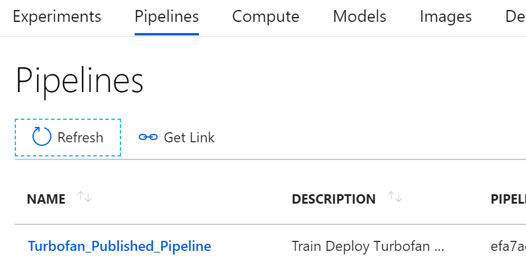
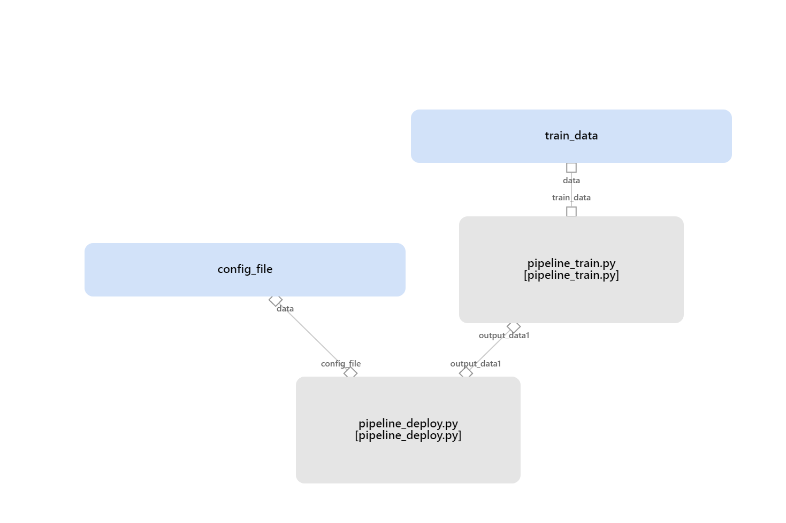

## Azure Machine Learning Pipeline

Use [Azure Machine Learning pipelines](https://docs.microsoft.com/en-us/azure/machine-learning/service/how-to-create-your-first-pipeline) to create a workflow that stitches together various ML phases, and then publish that pipeline into your Azure Machine Learning workspace to access later or share with others. ML pipelines are ideal for batch scoring scenarios, using various computes, reusing steps instead of rerunning them, as well as sharing ML workflows with others.

Create Pipeline:
 - [01-build-pipeline.py](01-build-pipeline.py)
   This script builds and deploys an ML pipeline using 2 steps: step 1 train model, step 2 deploy model. Once deployed the Pipeline RESTful endpoint can be used to trigger the entire pipeline to retrain and deploy a model.
 
 **When building the pipeline you will be asked to authenticate! Please update aml_config.json to use your workspace**
 
 
 Pipeline Resources:
 - [pipeline_train.py](pipeline_train.py)
   script used in pipeline for model training
 - [pipeline_deploy.py](pipeline_deploy.py)
   script used in pipeline for model deployment
 
 ## Deployed Pipeline
 
 
 ### Pipeline Graph
 
