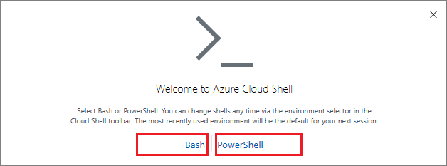
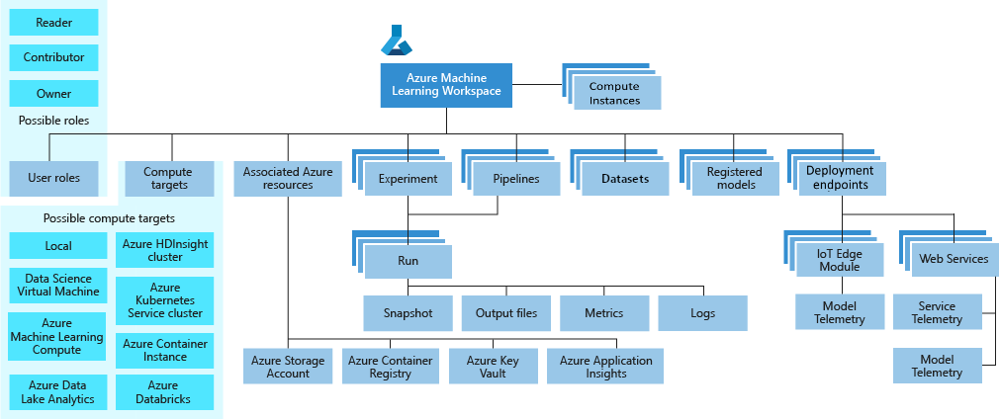

# Azure Machine Learning Examples - Predicting Remaining Useful Life of TurboFan


## 1 Getting Started

### Content
- [Azure Machine Learning Examples - Predicting Remaining Useful Life of TurboFan](#azure-machine-learning-examples---predicting-remaining-useful-life-of-turbofan)
  - [1 Getting Started](#1-getting-started)
    - [Content](#content)
    - [1.1 Azure Portal](#11-azure-portal)
      - [1.1.1 Do you have Enough Cores?](#111-do-you-have-enough-cores)
    - [1.2 Using Cloud Shell](#12-using-cloud-shell)
    - [1.3 Create a Resource Group](#13-create-a-resource-group)
      - [1.3.1 Resource Group - Use Azure CLI](#131-resource-group---use-azure-cli)
      - [1.3.2 Resource Group - Use Azure Portal](#132-resource-group---use-azure-portal)
    - [1.4 Create an Azure Storage Account](#14-create-an-azure-storage-account)
      - [1.4.1 Storage - Use Azure CLI](#141-storage---use-azure-cli)
      - [1.4.2 Storage - Use Azure Portal](#142-storage---use-azure-portal)
      - [1.4.3 Download Turbofan Data](#143-download-turbofan-data)
    - [1.5 Create Azure Machine Learning Workspace](#15-create-azure-machine-learning-workspace)
      - [1.5.1 Azure Machine Learning Workspace - Use Azure CLI](#151-azure-machine-learning-workspace---use-azure-cli)
      - [1.5.2 Azure Machine Learning Workspace - Use Azure Portal](#152-azure-machine-learning-workspace---use-azure-portal)
    - [1.6 Azure Databricks (Premium Tier)](#16-azure-databricks-premium-tier)
      - [1.6.1 Azure Databricks Workspace - Use Azure Portal](#161-azure-databricks-workspace---use-azure-portal)


### 1.1 Azure Portal

Azure subscription. If you don't have one, create a [free account](https://azure.microsoft.com/en-us/free/) before you begin.

#### 1.1.1 Do you have Enough Cores?

We will need to have enough cores available to use to spin up a multi-node Azure Databricks cluster and deploy to ACI (Azure Container Instance) at the very least. At the very minimum we would need 16 cores available ((4x) 4 Core VMs).

[View you usage and quotas.](https://docs.microsoft.com/en-us/azure/machine-learning/how-to-manage-quotas#view-your-usage-and-quotas)

### 1.2 Using Cloud Shell

The following bach commands will be ran using the [Azure Cloud Shell](https://docs.microsoft.com/en-us/azure/cloud-shell/overview). 

Launch from Azure portal using the Cloud Shell icon


Select __Bash__



### 1.3 Create a Resource Group

A resource group is a logical collection of Azure resources. All resources are deployed and managed in a resource group. To create a resource group:

#### 1.3.1 Resource Group - Use Azure CLI

```bash
resourceGroupName=azureml-$RANDOM
location=SouthCentralUS

az group create \
   --name $resourceGroupName \
   --location $location
```

#### 1.3.2 Resource Group - Use Azure Portal

[Create Resource Group](https://docs.microsoft.com/en-us/azure/event-hubs/event-hubs-create#create-a-resource-group)

### 1.4 Create an Azure Storage Account

An Azure storage account contains all of your Azure Storage data objects: blobs, files, queues, tables, and disks. Data in your Azure storage account is durable and highly available, secure, and massively scalable. We will use a storage account for our cold path storage and to store alert records.

#### 1.4.1 Storage - Use Azure CLI

```bash
accountName=azureml$RANDOM


az storage account create \
    --name $accountName \
    --resource-group $resourceGroupName \
    --location $location \
    --sku Standard_LRS \
    --kind StorageV2

az storage container create --account-name $accountName --name data

```

#### 1.4.2 Storage - Use Azure Portal

[Create Azure Storage Account](https://docs.microsoft.com/en-us/azure/storage/common/storage-account-create?tabs=azure-portal)

Create one container for model data using the portal: __data__

#### 1.4.3 Download Turbofan Data

**Run from Cloud Shell (Bash)

```bash

curl -L "https://raw.githubusercontent.com/Jscholtes128/Azure-AI-TurboFan-Hack/master/python/localscripts/data/turbofan.csv" > turbofan.csv


az storage blob upload \
    --account-name $accountName \
    --container-name data \
    --name turbofan.csv  \
    --file turbofan.csv

rm turbofan.csv
```

### 1.5 Create Azure Machine Learning Workspace

Azure Machine Learning can be used for any kind of machine learning, from classical ml to deep learning, supervised, and unsupervised learning. Whether you prefer to write Python or R code or zero-code/low-code options such as the designer, you can build, train, and track highly accurate machine learning and deep-learning models in an __Azure Machine Learning Workspace__.

__Pricing Tiers:__ Azure Machine Learning Service has two pricing tiers, _Basic_ and _Enterprise_. Basic will be sufficient for this material as we will use a 'code first' approach. Please review the [pricing tier documentation](https://azure.microsoft.com/en-us/pricing/details/machine-learning/).



#### 1.5.1 Azure Machine Learning Workspace - Use Azure CLI

```bash
workspace=azureml-$RANDOM
az extension add -n azure-cli-ml
az ml workspace create -w $workspace -g $resourceGroupName
```

#### 1.5.2 Azure Machine Learning Workspace - Use Azure Portal

[Create Azure Machine Learning Workspace](https://docs.microsoft.com/en-us/azure/machine-learning/how-to-manage-workspace)

### 1.6 Azure Databricks (Premium Tier)

Azure Databricks is an Apache Spark-based analytics platform optimized for the Microsoft Azure cloud services platform. 


#### 1.6.1 Azure Databricks Workspace - Use Azure Portal

During this event we will be looking at the best practices for securely connecting to data source; to accomplish this you will need to use Azure Databricks __premium tier__.

[Create Azure Databricks Workspace](https://docs.microsoft.com/en-us/azure/azure-databricks/quickstart-create-databricks-workspace-portal#create-an-azure-databricks-workspace)